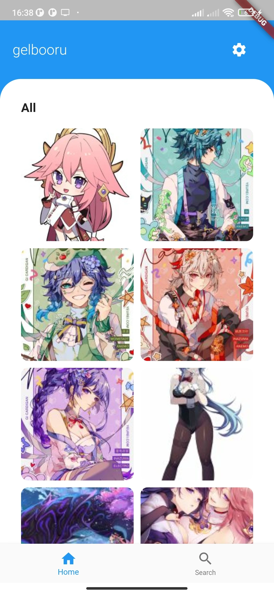
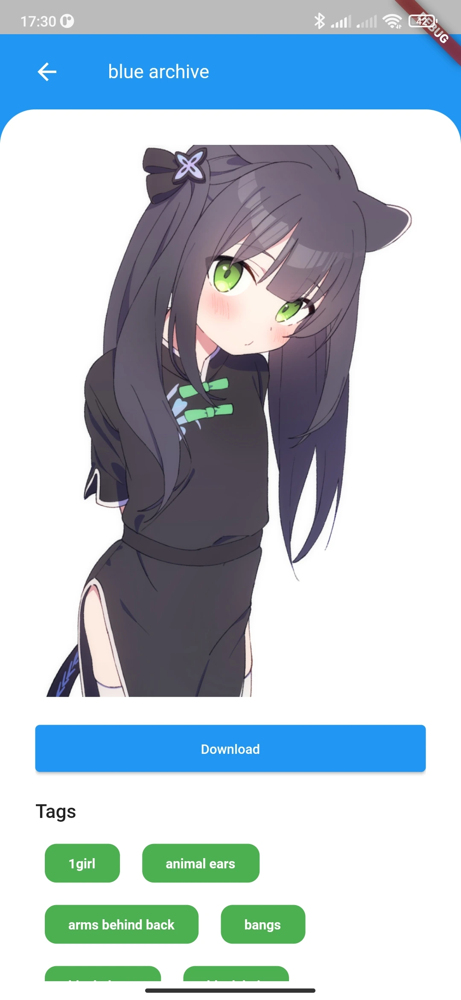

Este projeto teve como foco principal o meu aprendizado com Flutter, uma tecnologia que me chamou bastante atenção pela forma que funcionava para uma criação de um app mobile nativo.

Como base para aprender mais sobre Flutter, desenvolvi um aplicativo que exibe imagens de anime utilizando inicialmente a API do Gelbooru. Entretanto, o objetivo era manter uma integração genérica, para que fosse possível futuramente, a inserção de novas APIs com base em anime.

Entre os recursos adicionados estão:

- **Sistema de pesquisa:** Por padrão, o usuário pode buscar por nomes de imagens, assim como tags que eram providas pela API
- **Download pelo aplicativo:** As imagens poderiam ser baixadas diretamente pelo aplicativo, salvas na pasta de Downloads
- **Ad-free:** A ideia é não ter anúncios irritantes nem nada que atrapalhe a navegação para que o aplicativo seja direto ao ponto

Tela ínicial            |  Tela com detalhes da imagem selecionada
:-------------------------:|:-------------------------:
 | 
