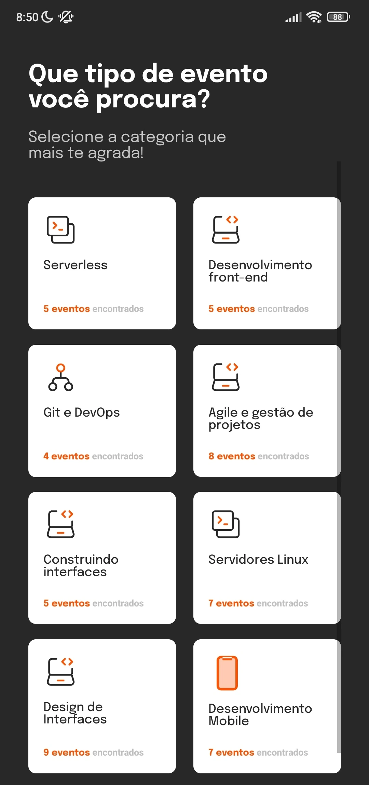
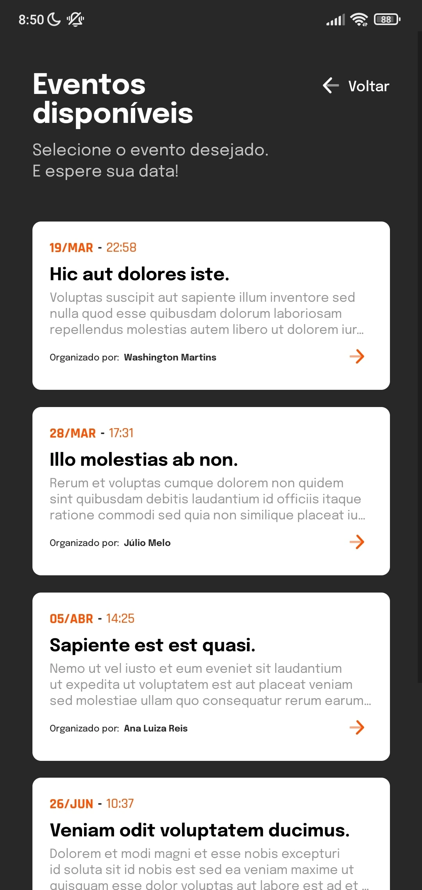

Este projeto foi desenvolvido em conjunto com alguns amigos como parte de um desafio da comunidade Ballerini. O objetivo era criar um aplicativo que permitisse a desenvolvedores encontrar eventos relacionados à sua área de trabalho.

Foi uma oportunidade bem legal, e criar um aplicativo react-native do zero em grupo foi importante para expandirmos o aprendizado em relação ao mobile e seus frameworks.

Infelizmente não tenho mais a postagem no LinkedIn falando sobre os projetos ganhadores. 😢

Tela de carregamento             |  Tela ínicial
:-------------------------:|:-------------------------:
 | 

Tela de tópicos             |  Tela de eventos
:-------------------------:|:-------------------------:
 | 
