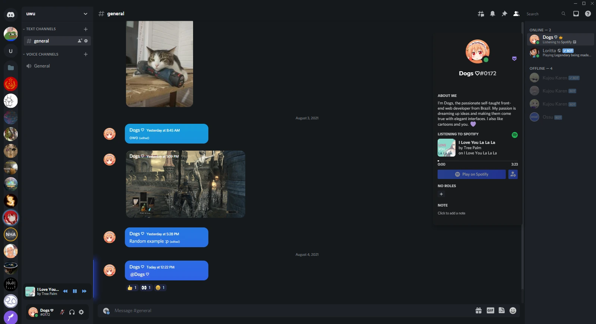

Desenvolvi um tema personalizado para Discord que transforma a interface em um visual mais moderno, com elementos arredondados e design do chat inspirado no Meta Messenger. O tema foi pensado com um modo escuro AMOLED, ao contrário do visual mais "cinzento" que o Discord possuí.

Para aplicar os estilos, foi necessário utilizar o BetterDiscord, uma modificação que permite integrar códigos de terceiros no Discord on-the-fly.

Infelizmente, os estilos já não funcionam perfeitamente, por conta das grandes mudanças vísuais que o Discord teve ao longo dos últimos anos, portanto, irei deixa-lo apenas de recordação.

