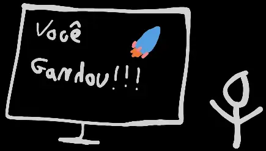

Este projeto foi desenvolvido como parte de um desafio da Rocketseat, com o objetivo de criar um site simples para uma escola de Educação a Distância (EAD). Para o desafio, optei por utilizar o confiável ReactJS, para focar em praticar minhas habilidades em front-end e frameworks reativos.

No final, consegui desenvolver um projeto que atendeu às expectativas da Rocketseat. Garantindo minha oportunidade de ganhar o curso de React deles. 🚀

Essa conquista me deu mais motivação para continuar me aprofundando no ecossistema React e explorando novas possibilidades no desenvolvimento web.

