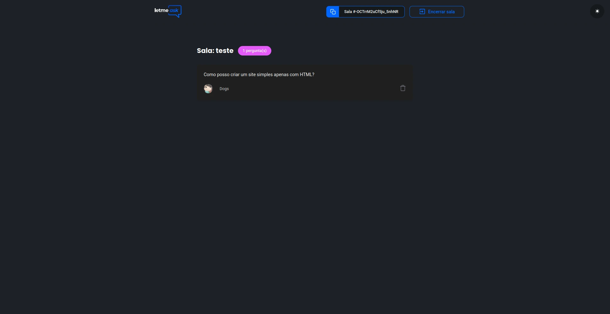

Este projeto foi desenvolvido durante a Semana NLW (Next Level Week) da Rocketseat em 2021. O projeto consistia em criar uma aplicação web para trocas de perguntas e respostas em tempo real.

Utilizei tecnologias como React para o front-end e Firebase para o back-end, permitindo a comunicação entre os usuários. Foi muito bom para me situar no mundo do Firebase Serveless e seus bancos de dados real time.

