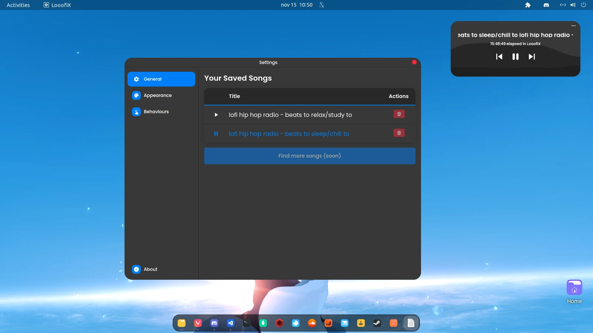

O Looofix é um player de música criado com o foco em transmitir músicas lofi, feito para ser simples e com uma transmissão contínua. Ao abrir o player, ele se conecta a um backend desenvolvido em NodeJS, que localiza e transmite livestreams do gênero lofi em tempo real (busca realizada pela API do Youtube).

O aplicativo ainda tem poucas funções, espero no futuro adicionar mais coisas que estão no Roadmap, dentre as possíveis features futuras tempos:

- Integração com pomodoro
- Sistema de temas mais dinâmico e customizável, com possíbilidade de compartilha-lo com amigos
- Frases motivacionais
- Listagem e busca de streams diretamente pelo aplicativo
- Melhoria de performance (saindo do electron para a criação de um aplicativo nativo)

