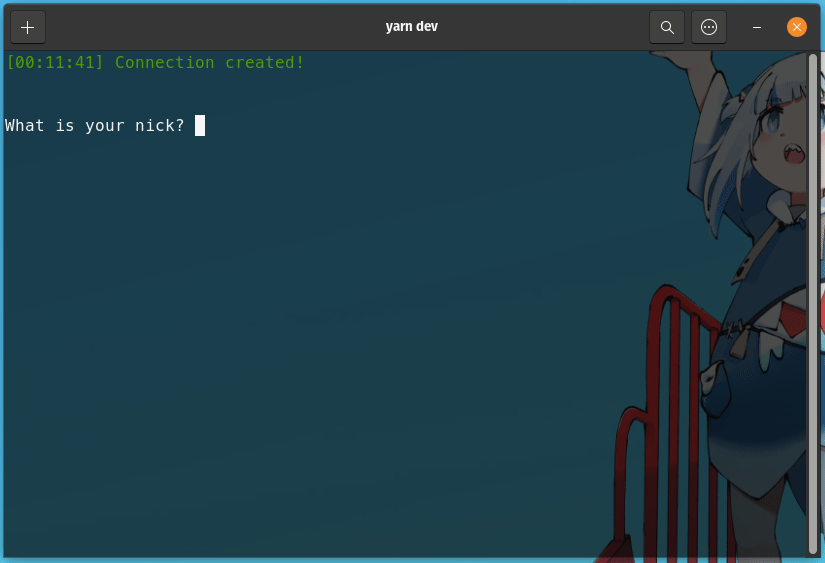

Um projeto simples de chat em tempo real que opera diretamente no terminal, utilizando o Firebase como backend para essa troca de mensagens. A ideia com o projeto foi de usar algumas funcionalidades do Real Time Firebase para saber como implementa-lo em uma aplicação real.

O projeto tem alguns comandos de exemplo que foram implementados de forma genérica para o foco em escalabilidade. Nele também é possível criar ou entrar em salas/grupos por meio de um código único escolhido pela própria pessoa.

